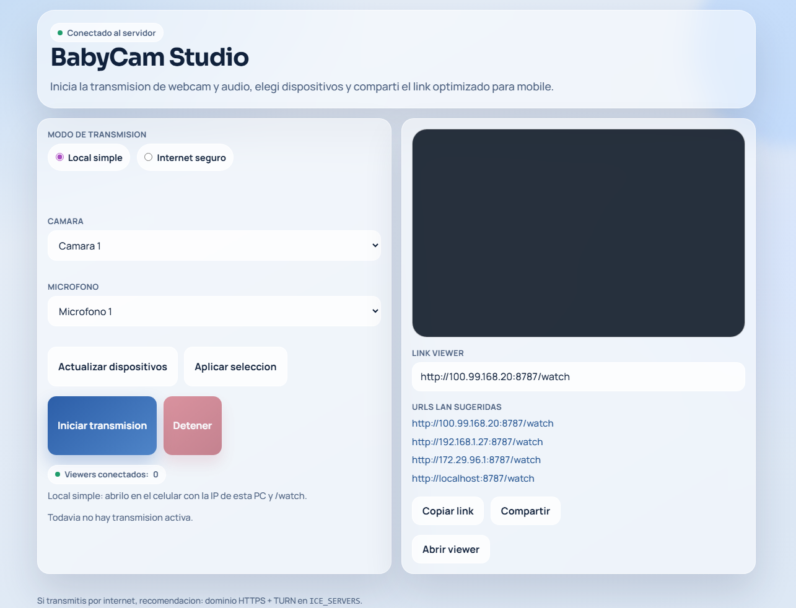

# BabyCam Monitor

BabyCam es una aplicacion web de monitoreo en tiempo real (audio + video) para usar una webcam como baby monitor personal.

Incluye una interfaz Host para la computadora con camara y una interfaz Viewer optimizada para mobile, con dos modos de acceso:

- `Local simple`: sin QR ni sesion, viewer directo por IP en `/watch`.
- `Internet seguro`: link con sala + clave de acceso.

## Preview

Vista del panel Host:



## Caracteristicas

- Streaming en vivo con `WebRTC` (baja latencia).
- Servicio de senializacion con `Node.js + Express + Socket.IO`.
- Seleccion de multiples camaras y microfonos.
- Selector de calidad de transmision (Ahorro / Balanceada / Alta / Maxima).
- Fallback robusto de captura:
  - prioriza video,
  - intenta audio cuando esta disponible,
  - informa errores claros de permisos/dispositivos.
- UI mobile-first estilo glass iOS para experiencia de visualizacion en celular.
- Modo local simplificado:
  - iniciar y abrir `http://IP_DE_LA_PC:8787/watch` desde el celular.
- Modo internet seguro:
  - link con sala y clave (`/watch/<sala>?key=<clave>`),
  - QR disponible solo para modo seguro.
- Control remoto desde Viewer:
  - iniciar o detener la transmision directamente desde el cliente.

## Arquitectura

- `server.js`
  - servidor HTTP,
  - Socket.IO para salas (`host`/`viewer`) y senializacion WebRTC,
  - endpoint de configuracion ICE (`/api/config`),
  - endpoint para QR (`/api/qr`).
- `public/host.html` + `public/host.js`
  - preview local,
  - seleccion de dispositivos,
  - control de inicio/parada de transmision.
- `public/viewer.html` + `public/viewer.js`
  - recepcion de stream remoto,
  - controles mobile (mute, fullscreen, retry, formato Ajustar/Llenar).

## Requisitos

- Node.js `18+`
- Navegador moderno con soporte WebRTC
- Para acceso remoto estable: `HTTPS` + servidor `TURN`

## Instalacion

```bash
npm install
```

## Ejecucion con Docker

Construir y levantar contenedor:

```bash
docker compose up -d --build
```

Detener:

```bash
docker compose down
```

Variables utiles para Docker:

- `WEBUI_PORT` (default: `8787`) para cambiar puerto publicado.
- `PUBLIC_BASE_URL` para links publicos en modo seguro.
- `ICE_SERVERS` con JSON de STUN/TURN.
- `CONTROL_STREAM_TIMEOUT_MS` para timeout de control remoto.

## Ejecucion local

```bash
npm start
```

URLs principales:

- Host: `http://localhost:8787/host`
- Viewer local: `http://localhost:8787/watch`
- Viewer internet seguro: `http://localhost:8787/watch/<sala>?key=<clave>`

## CasaOS

Este repo incluye plantilla para CasaOS Store en:

- `casaos/docker-compose.store.yml`

Flujo recomendado:

1. Publicar imagen Docker con tag fijo (ejemplo `ghcr.io/elgodox/babycam-monitor:1.0.0`).
2. Actualizar `image`, `icon` y `screenshot_link` en `casaos/docker-compose.store.yml`.
3. Probar instalacion en tu CasaOS local.
4. Subir PR a `IceWhaleTech/CasaOS-AppStore` creando `Apps/BabyCam/docker-compose.yml` + assets.

## Variables de entorno

- `PORT` (default: `8787`)
- `HOST` (default: `0.0.0.0`)
- `PUBLIC_BASE_URL`
  - URL publica base para generar links de share.
  - Ejemplo: `https://babycam.tudominio.com`
- `ICE_SERVERS`
  - JSON de STUN/TURN para WebRTC.

Ejemplo:

```bash
ICE_SERVERS=[{"urls":["stun:stun.l.google.com:19302"]},{"urls":["turn:turn.tudominio.com:3478"],"username":"user","credential":"pass"}]
```

## Publicacion por internet

1. Exponer el servidor via HTTPS (Cloudflare Tunnel, reverse proxy o VPS).
2. Definir `PUBLIC_BASE_URL` con tu dominio publico.
3. Configurar `ICE_SERVERS` con TURN para conexiones entre redes distintas.
4. En Host, seleccionar modo `Internet seguro` y compartir el link con clave.

## Uso rapido

1. Abrir `/host` en la PC con webcam.
2. Seleccionar camara/microfono.
3. Elegir modo:
   - `Local simple`: abrir `/watch` desde el celular en la misma red.
   - `Internet seguro`: usar link con `sala + key`.
4. Iniciar transmision.

## Troubleshooting

- No aparece imagen:
  - usar `localhost` o `https` (evitar contexto inseguro),
  - habilitar permisos de camara en el navegador,
  - cerrar apps que esten ocupando la camara (Meet, Zoom, OBS, Teams).
- No hay audio en mobile:
  - tocar `Tocar para activar audio`,
  - revisar permisos de microfono en host.
- Conexion remota inestable:
  - verificar TURN en `ICE_SERVERS`.
- Modo seguro rechaza acceso:
  - confirmar que el link tenga `?key=...` valido.

## Licencia

MIT
